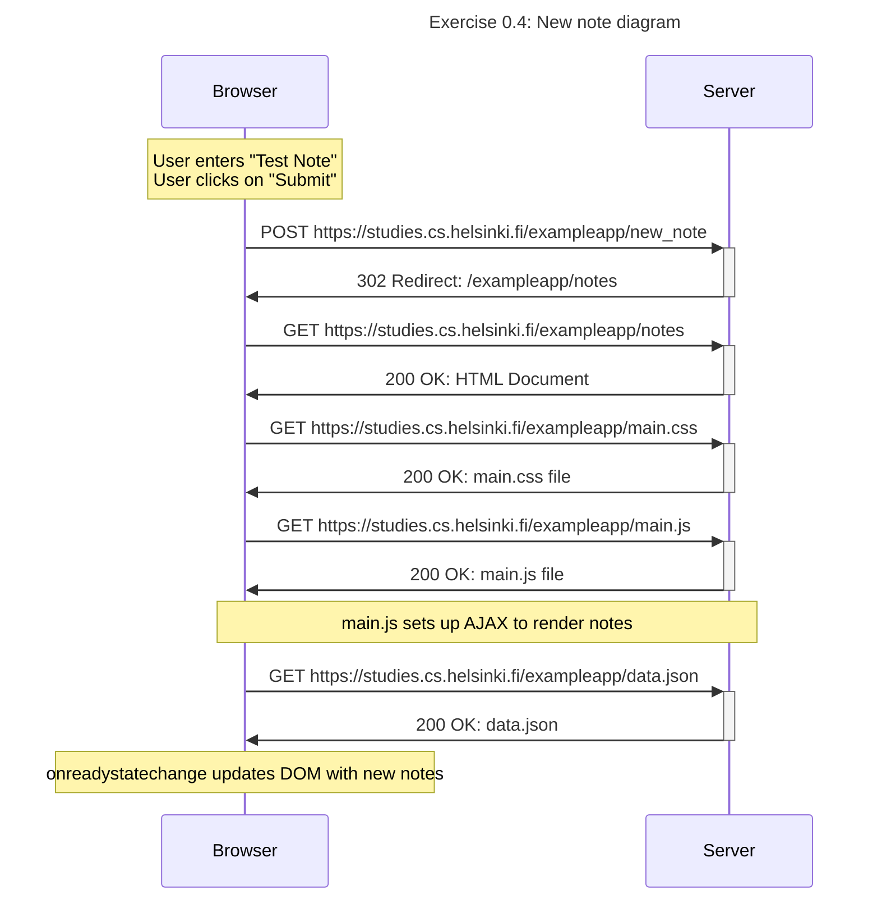

```mermaid
sequenceDiagram
    title Exercise 0.4: New note diagram

    participant Browser
    participant Server

    note over Browser: User enters "Test Note" <br/> User clicks on "Submit"

    Browser->>+Server: POST https://studies.cs.helsinki.fi/exampleapp/new_note
    Server->>-Browser: 302 Redirect: /exampleapp/notes

    Browser->>+Server: GET https://studies.cs.helsinki.fi/exampleapp/notes
    Server->>-Browser: 200 OK: HTML Document

    Browser->>+Server: GET https://studies.cs.helsinki.fi/exampleapp/main.css
    Server->>-Browser: 200 OK: main.css file

    Browser->>+Server: GET https://studies.cs.helsinki.fi/exampleapp/main.js
    Server->>-Browser: 200 OK: main.js file

    note over Browser,Server: main.js sets up AJAX to render notes

    Browser->>+Server: GET https://studies.cs.helsinki.fi/exampleapp/data.json
    Server->>-Browser: 200 OK: data.json

    note over Browser: onreadystatechange updates DOM with new notes
```