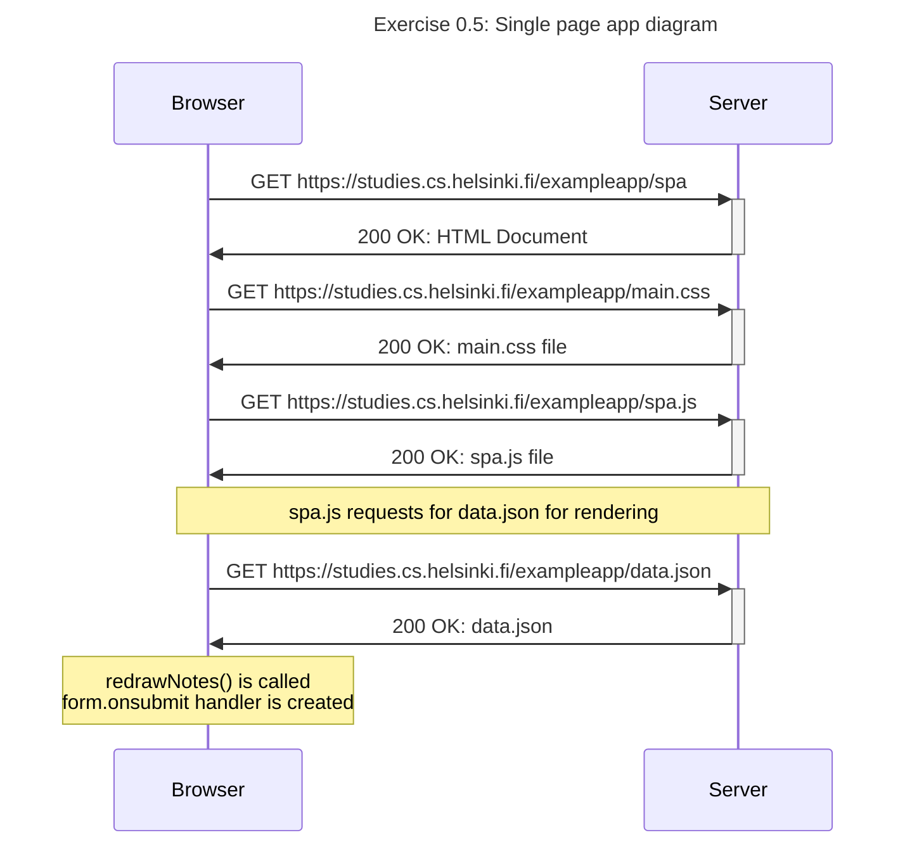

```mermaid
sequenceDiagram
    title Exercise 0.5: Single page app diagram

    participant Browser
    participant Server

    Browser->>+Server: GET https://studies.cs.helsinki.fi/exampleapp/spa
    Server->>-Browser: 200 OK: HTML Document

    Browser->>+Server: GET https://studies.cs.helsinki.fi/exampleapp/main.css
    Server->>-Browser: 200 OK: main.css file

    Browser->>+Server: GET https://studies.cs.helsinki.fi/exampleapp/spa.js
    Server->>-Browser: 200 OK: spa.js file

    note over Browser,Server: spa.js requests for data.json for rendering

    Browser->>+Server: GET https://studies.cs.helsinki.fi/exampleapp/data.json
    Server->>-Browser: 200 OK: data.json

    note over Browser: redrawNotes() is called <br/> form.onsubmit handler is created
```