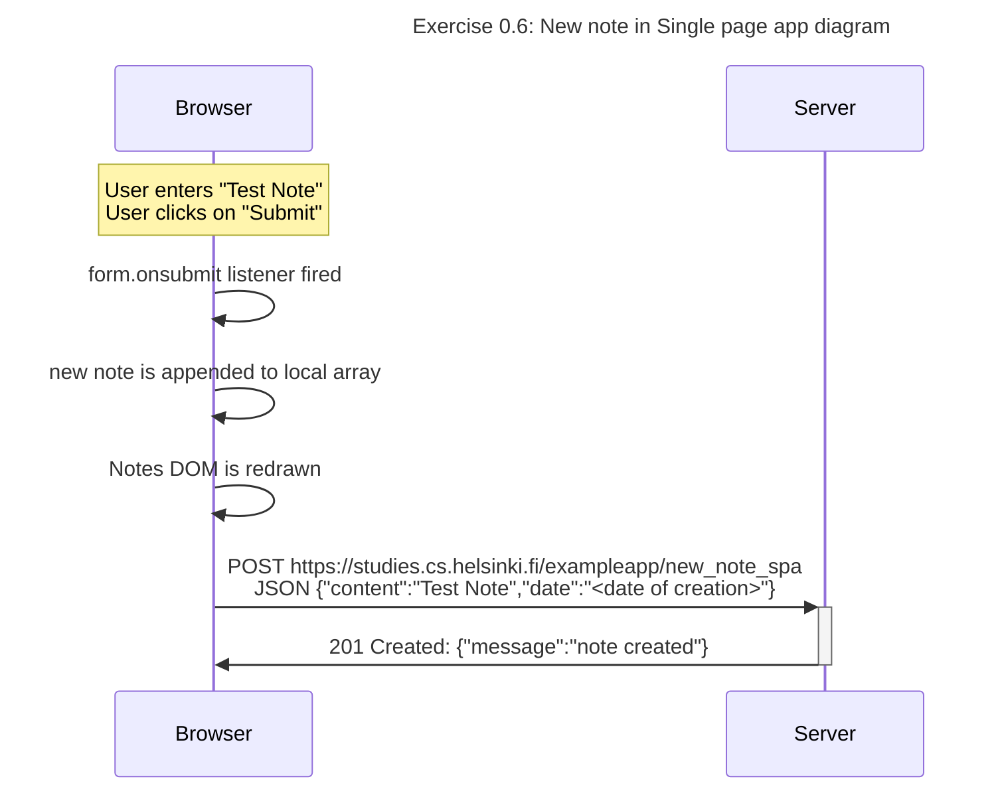

```mermaid
sequenceDiagram
    title Exercise 0.6: New note in Single page app diagram

    participant Browser
    participant Server

    note over Browser: User enters "Test Note" <br/> User clicks on "Submit"

    Browser->>Browser: form.onsubmit listener fired

    Browser->>Browser: new note is appended to local array

    Browser->>Browser: Notes DOM is redrawn

    Browser->>+Server: POST https://studies.cs.helsinki.fi/exampleapp/new_note_spa <br/> JSON {"content":"Test Note","date":"<date of creation>"}
    Server->>-Browser: 201 Created: {"message":"note created"}
```